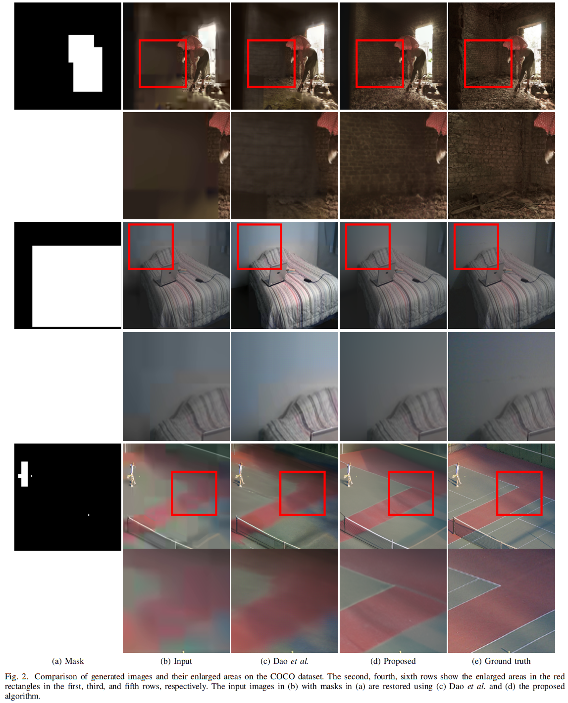
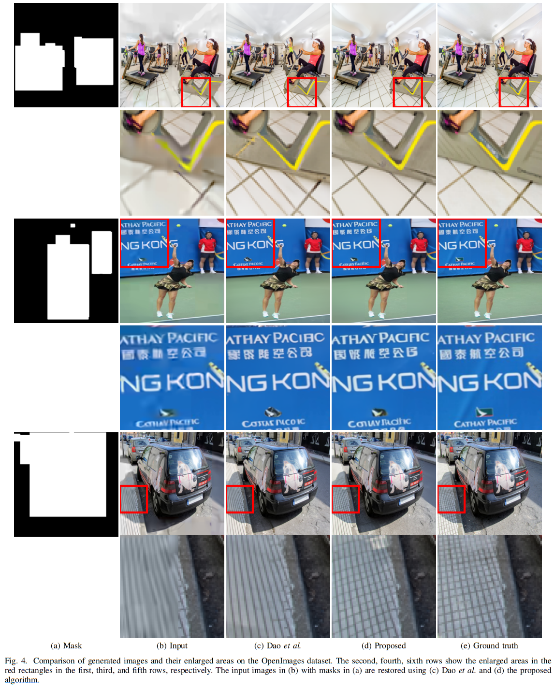
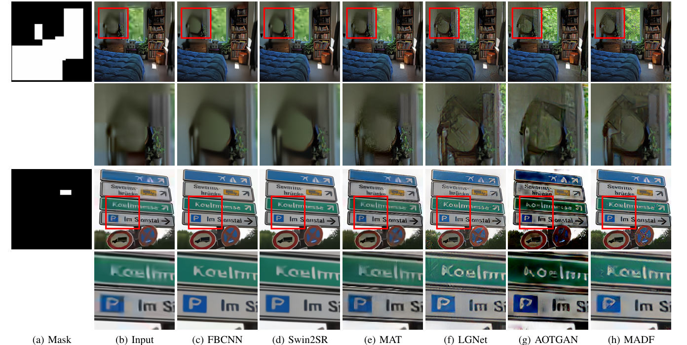

# GGDR
This repository includes the implementation for "Gradient-Guided Diffusion-Based Restoration of Extremely Compressed Backgrounds for Video Coding for Machines"

### Experimental results
We show the restoration results of our preliminary work (https://ieeexplore.ieee.org/document/10648159) compared with the proposed algorithm.

**Comparison of the restoration results on the COCO dataset**

**Comparison of the restoration results on the OID dataset**

### Experimental results
We also show more qualitative results of the proposed algorithm compared with SOTA algorithms.

**Comparison of the restoration results on the COCO dataset**

**Comparison of the restoration results on the OID dataset**

